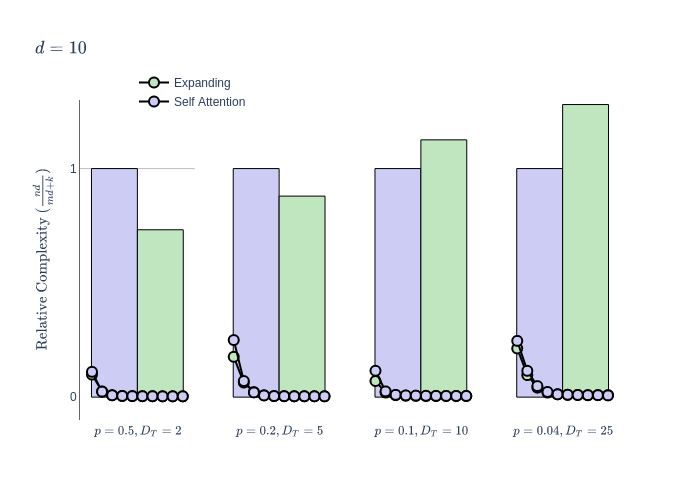
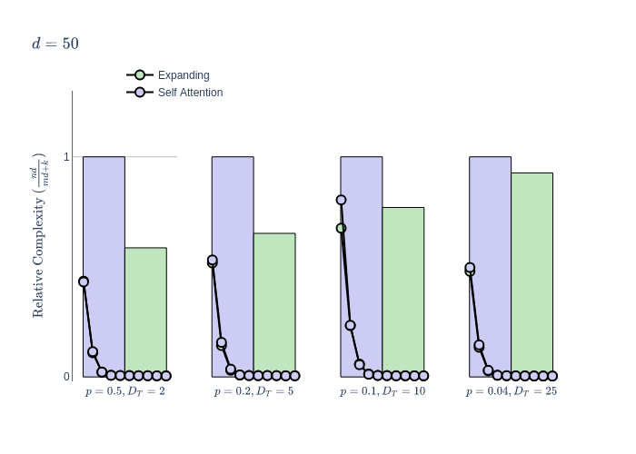

# Attention as Structural Inference

Testing the theory that the attention mechanism enables context specific meta-learning through small examples that showcase mechanistic understanding

---
## Expanding Attention
Expanding attention adjusts the implicit uniform prior two be geometrically decaying, with a conjugate beta hyperprior.
 

